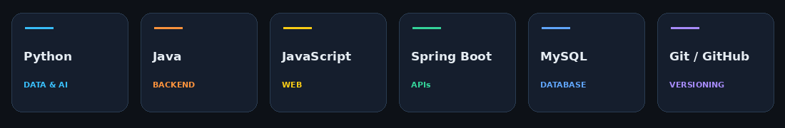

  

  <a href="https://shankeerthan17.github.io/Portfolio/"><b>Portfolio</b></a> &nbsp; • &nbsp;
  <a href="https://www.linkedin.com/in/shankeerthan-it"><b>LinkedIn</b></a> &nbsp; • &nbsp;
  <a href="mailto:shankeerthan111@gmail.com"><b>Email</b></a>

<h2 align="center">Curiosity → Data → Insights</h2>
<table>
<tr>
<td width="52%" valign="top">
Hello, I'm Shankeerthan
I'm a second-year BSc (Hons) in Information Technology undergraduate at SLIIT, Sri Lanka.
Primary interests: Data Science, Data Analytics, and Machine Learning.
Also building: web applications and REST APIs with Java, Spring Boot, and MySQL.
Learning through: practical projects, problem-solving, and collaboration.
Open to: IT internship opportunities where I can contribute and grow.
</td>
<td width="48%" align="center">

</td>
</tr>
</table>

<h2 align="center">Technologies & Tools</h2>

IntelliJ IDEA &nbsp; • &nbsp; VS Code &nbsp; • &nbsp; Object-Oriented Programming

<h2 align="center">Selected Projects</h2>
Event Photography & Videography Booking System
A web-based booking system built with Java, Spring Boot, and MySQL. My work includes REST APIs for bookings, availability, service packages, and customer requests, along with authentication and role-based access for administrators and customers.
Explore the repository →
Personal Portfolio
A dedicated space to explore my work, technical interests, and professional journey.
Visit the portfolio →   |   View the source →

<h2 align="center">Learning & Achievements</h2>
Milestone	Details
Dean's List — SLIIT	Year 1 Semester 1 (2025) and Semester 2 (2026)
AI/ML Engineer — Stage 01	SLIIT certification program, 2026
Data & AI learning	Completed NoviTech R&D 30-day internship programs in Data Analytics, Artificial Intelligence, Python Programming, and Machine Learning, 2025

<h2 align="center">Let's Connect</h2>

Interested in internships, collaborative projects, and conversations about data and software.

<a href="https://www.linkedin.com/in/shankeerthan-it"><b>LINKEDIN</b></a> &nbsp; / &nbsp;
<a href="https://shankeerthan17.github.io/Portfolio/"><b>PORTFOLIO</b></a> &nbsp; / &nbsp;
<a href="mailto:shankeerthan111@gmail.com"><b>EMAIL</b></a>

Learn with purpose. Build with care.

