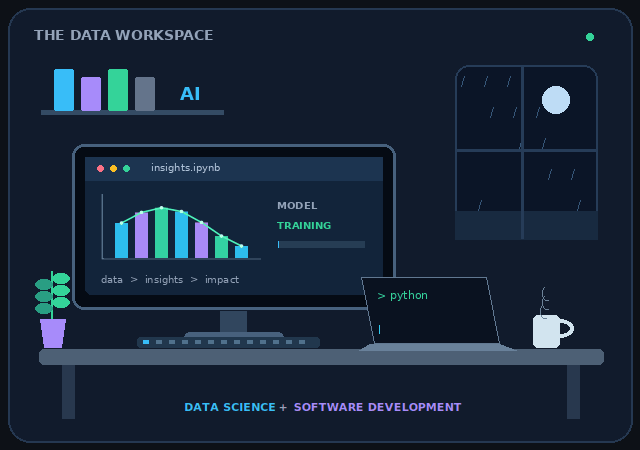
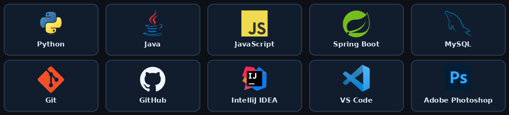

  

   &nbsp;
   &nbsp;
  

<h2 align="center">Curiosity → Data → Insights</h2>

<table>
<tr>
<td width="44%" valign="top">

### Hello, I'm Shankeerthan

I'm a second-year **BSc (Hons) in Information Technology** undergraduate at **SLIIT**, Sri Lanka.

- **Primary interests:** Data Science, Data Analytics, and Machine Learning.
- **Also building:** web applications and REST APIs with Java, Spring Boot, and MySQL.
- **Learning through:** practical projects, problem-solving, and collaboration.
- **Open to:** IT internship opportunities where I can contribute and grow.

</td>
<td width="56%" align="center" valign="middle">

</td>
</tr>
</table>

<h2 align="center">Technologies & Tools</h2>

Programming · Backend · Databases · Development Tools · Design

<h2 align="center">Selected Projects</h2>

### Event Photography & Videography Booking System

A **Java, Spring Boot & MySQL** booking platform with REST APIs and role-based access.

**[Explore the repository →](https://github.com/Shankeerthan17/Event-Photography-and-Videography-Booking-System)**

### Personal Portfolio

My projects, skills, and professional journey in one place.

**[Visit the portfolio →](https://shankeerthan17.github.io/Portfolio/)** &nbsp; | &nbsp; **[View the source →](https://github.com/Shankeerthan17/Portfolio)**

<h2 align="center">Learning & Achievements</h2>

| Milestone | Details |
| :--- | :--- |
| Dean's List — SLIIT | Year 1 Semester 1 (2025) and Semester 2 (2026) |
| AI/ML Engineer — Stage 01 | SLIIT certification program, 2026 |
| Data & AI learning | Completed NoviTech R&D 30-day internship programs in Data Analytics, Artificial Intelligence, Python Programming, and Machine Learning, 2025 |

<h2 align="center">Let's Connect</h2>

Interested in internships, collaborative projects, and conversations about data and software.

 &nbsp;
 &nbsp;

Learn with purpose. Build with care.

